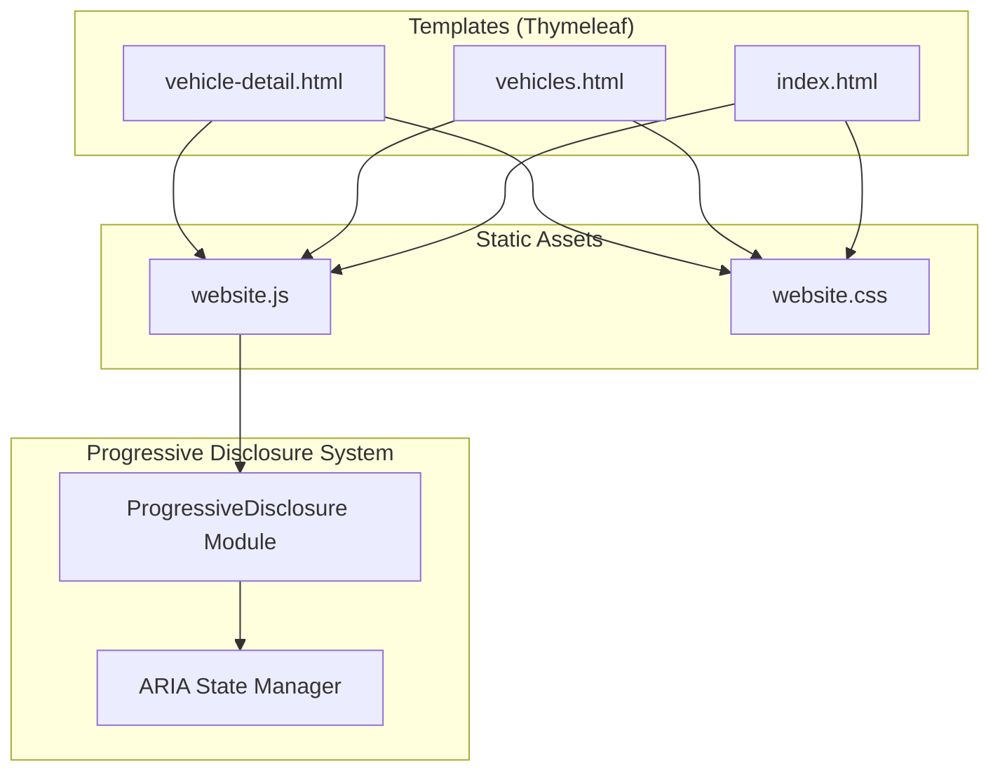
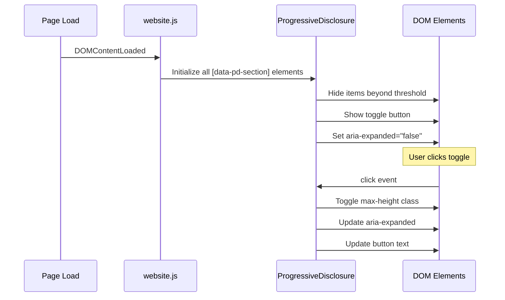

# Design Document: Vehicle Module UI Enhancement

## Overview

This design addresses frontend-only UI enhancements across three Thymeleaf templates (`vehicle-detail.html`, `vehicles.html`, `index.html`) in a Spring Boot + Bootstrap 5 application. The core goal is to introduce a reusable, accessible progressive disclosure system (Read More / View More), improve the gallery with category-based sorting, add brand logo images to the home page, and ensure visual stability (CLS < 0.1) across viewports.

**Key Design Decisions:**
1. **Refactor inline JS into a single reusable module** — The existing `toggleSection`, `toggleFaqSection`, and `toggleDescription` functions will be consolidated into `website.js` as a unified `ProgressiveDisclosure` component.
2. **No backend changes** — All sorting (gallery images by category) will happen client-side via Thymeleaf's `#lists.sort` or JS-based reordering using existing `VehicleImage.category` data.
3. **CSS-driven expand/collapse** — Use CSS `max-height` transitions with `overflow: hidden` to eliminate CLS, rather than `display:none` toggling which causes layout shifts.
4. **Progressive enhancement** — If JS fails to load, all content remains visible (hidden items are hidden via JS initialization, not server-side).

## Architecture



### Component Interaction Flow



## Components and Interfaces

### 1. ProgressiveDisclosure Module (`website.js`)

A reusable JS module that handles all expand/collapse behavior across sections.

**Configuration via data attributes:**

| Attribute | Purpose | Example |
|-----------|---------|---------|
| `data-pd-section` | Marks a section as progressive disclosure container | `data-pd-section="variants"` |
| `data-pd-limit` | Number of items to show initially | `data-pd-limit="4"` |
| `data-pd-item` | Marks each child item within the section | `data-pd-item` |
| `data-pd-toggle` | Marks the toggle button | `data-pd-toggle` |
| `data-pd-label-more` | Collapsed state label | `data-pd-label-more="Read More"` |
| `data-pd-label-less` | Expanded state label | `data-pd-label-less="Show Less"` |

**Public Interface:**

```javascript
/**
 * ProgressiveDisclosure - Reusable expand/collapse component
 * 
 * Initializes all sections marked with [data-pd-section] on the page.
 * Manages aria-expanded, aria-controls, visibility, and button text.
 */
const ProgressiveDisclosure = {
    /**
     * Initialize all progressive disclosure sections on the page.
     * Called once on DOMContentLoaded.
     */
    init() {},

    /**
     * Initialize a single section.
     * @param {HTMLElement} section - The container element with data-pd-section
     */
    initSection(section) {},

    /**
     * Toggle the expand/collapse state of a section.
     * @param {HTMLElement} section - The container element
     */
    toggle(section) {}
};
```

### 2. Gallery Sorting (Thymeleaf + JS)

Gallery images will be sorted client-side using the existing `category` field from `VehicleImage`. The Thymeleaf template already passes `images` list; we add a `data-category` attribute to each image and use JS to reorder DOM nodes on page load.

**Sorting priority:**
1. `exterior` / `vehicle` → first
2. All other categories → maintain original `displayOrder`

### 3. Brand Logo Component (index.html)

The brand card on the home page will use an `` element with the brand logo URL. Since the current data model does not include a `logoUrl` field on brands (brands are just strings from `vehicleService.getDistinctBrands()`), the logo will be served from a convention-based static path:

**Convention:** `/images/brands/{brand-slug}.png`

Example: For brand "Maruti Suzuki" → `/images/brands/maruti-suzuki.png`

The template will attempt to load the logo image and fall back to the existing Font Awesome car icon on error using an `onerror` handler.

### 4. CSS Transition System (`website.css`)

New CSS classes for smooth expand/collapse without layout shift:

```css
/* Progressive Disclosure */
.pd-content { overflow: hidden; transition: max-height 0.3s ease-out; }
.pd-content.collapsed { max-height: var(--pd-collapsed-height); }
.pd-content.expanded { max-height: none; }
.pd-item-hidden { display: none; }  /* Applied by JS after measurement */
.pd-toggle { /* toggle button styles */ }
```

**CLS Prevention Strategy:**
- Reserve space with `min-height` on gallery image containers (200px fixed height)
- Use CSS transitions rather than abrupt show/hide
- Apply `content-visibility: auto` on below-fold sections for rendering optimization

## Data Models

No new database entities or backend changes are required. The design relies entirely on existing data:

### Existing Data Used

| Entity | Fields Used | Purpose |
|--------|-------------|---------|
| `Vehicle` | `thumbnailImage`, `heroImage`, `name`, `brand` | Listing image, brand identification |
| `VehicleImage` | `imageUrl`, `altText`, `category`, `displayOrder` | Gallery sorting & display |
| `VehicleVariant` | all fields | Variant table rows |
| `VehicleSpecification` | `specName`, `specValue` | Spec rows |
| `VehicleFeature` | `featureName` | Feature grid items |
| `VehicleFaq` / `ModelFaq` | `question`, `answer` | FAQ accordion items |

### Brand Logo Convention

| Convention | Pattern | Example |
|-----------|---------|---------|
| Logo file path | `/static/images/brands/{slug}.png` | `/static/images/brands/hyundai.png` |
| Slug generation | `brand.toLowerCase().replace(' ', '-')` | "Maruti Suzuki" → `maruti-suzuki` |
| Fallback | Font Awesome `fa-car` icon | When image fails to load |

### Data Attributes Contract (HTML ↔ JS)

```html
<!-- Section container -->
<div data-pd-section="variants" data-pd-limit="4">
    <!-- Items -->
    <tr data-pd-item>...</tr>
    <!-- Toggle button -->
    <a data-pd-toggle 
       data-pd-label-more="Read More" 
       data-pd-label-less="Show Less"
       aria-expanded="false"
       aria-controls="variants-content">
        Read More
    </a>
</div>
```


## Correctness Properties

*A property is a characteristic or behavior that should hold true across all valid executions of a system — essentially, a formal statement about what the system should do. Properties serve as the bridge between human-readable specifications and machine-verifiable correctness guarantees.*

### Property 1: Progressive Disclosure Initialization

*For any* list of items with length N and a configured threshold T where N > T, after the ProgressiveDisclosure module initializes the section, exactly the first T items shall be visible, all items at index ≥ T shall be hidden, and the toggle button shall be displayed with the "more" label text.

**Validates: Requirements 1.1, 1.2, 2.1, 2.2, 3.1, 3.2, 4.2, 4.3, 5.1, 5.2**

### Property 2: Progressive Disclosure Round-Trip (Idempotence)

*For any* progressive disclosure section in its initial (collapsed) state, performing a toggle (expand) followed by a toggle (collapse) shall return the section to a state identical to its post-initialization state — the same items visible, the same items hidden, and the toggle button showing the "more" label text.

**Validates: Requirements 1.5, 2.5, 3.5, 4.6, 5.5**

### Property 3: Gallery Image Sort Invariant

*For any* list of vehicle images with mixed categories, after the gallery sort is applied, all images with category "exterior" or "vehicle" shall appear at indices lower than all images with any other category (e.g., "interior", "gallery"), while preserving relative order within each group.

**Validates: Requirements 4.1**

### Property 4: Lazy Loading Assignment for Hidden Images

*For any* gallery section with more than 6 images, after initialization, all images at index ≥ 6 (those initially hidden) shall have the `loading="lazy"` attribute set.

**Validates: Requirements 4.8**

### Property 5: ARIA Expanded State Consistency

*For any* progressive disclosure section and any sequence of toggle operations, the `aria-expanded` attribute on the toggle button shall always equal `"true"` when the hidden content is visible, and `"false"` when the hidden content is collapsed.

**Validates: Requirements 9.1**

### Property 6: ARIA Controls Reference Validity

*For any* progressive disclosure section after initialization, the toggle button's `aria-controls` attribute value shall correspond to the `id` attribute of an existing DOM element that contains the expandable content.

**Validates: Requirements 9.2**

## Error Handling

### Image Loading Failures

| Scenario | Handling Strategy |
|----------|------------------|
| Vehicle thumbnail fails to load | `onerror` handler hides ``, shows adjacent placeholder `<div>` with car icon |
| Brand logo fails to load | `onerror` handler hides ``, shows fallback Font Awesome car icon |
| Gallery image fails to load | Image renders with broken icon; lightbox skips broken images |

### JavaScript Failure (Progressive Enhancement)

If `website.js` fails to load or execute:
- All content remains visible (items are only hidden after JS initializes)
- Toggle buttons are rendered with `style="display:none"` by default and shown by JS
- The page remains fully functional, just without progressive disclosure

### Edge Cases

| Case | Behavior |
|------|----------|
| Section with 0 items | Section not rendered (Thymeleaf `th:if` guard) |
| Section with exactly threshold items | All items shown, no toggle button |
| Brand with no logo file | Fallback to Font Awesome icon via `onerror` |
| Image with null `altText` | Render empty `alt=""` (still accessible, indicates decorative) |
| Image with null `category` | Treated as "other" category, sorted after exterior/vehicle |

## Testing Strategy

### Unit Tests (Example-Based)

| Test | Validates |
|------|-----------|
| Vehicle card renders thumbnailImage when available | Req 6.1 |
| Vehicle card renders placeholder when thumbnailImage is null | Req 6.2 |
| Brand card renders logo img with correct convention path | Req 7.1 |
| Brand card fallback shows icon on image error | Req 7.4 |
| Placeholder has aria-label="No image available" | Req 9.5 |
| Gallery images have alt text from data | Req 9.3 |
| Brand logo alt text contains brand name | Req 9.4 |
| Toggle button hidden when items ≤ threshold | Req 1.6, 2.6, 3.6, 4.7, 5.6 |

### Property-Based Tests

**Library:** fast-check (JavaScript property-based testing)

**Configuration:** Minimum 100 iterations per property test.

| Property Test | Tag |
|---------------|-----|
| Progressive disclosure init shows exactly T items | Feature: vehicle-module-ui-enhancement, Property 1: Progressive Disclosure Initialization |
| Expand-then-collapse round-trip restores initial state | Feature: vehicle-module-ui-enhancement, Property 2: Progressive Disclosure Round-Trip |
| Gallery sort places exterior/vehicle before others | Feature: vehicle-module-ui-enhancement, Property 3: Gallery Image Sort Invariant |
| Hidden images get loading="lazy" | Feature: vehicle-module-ui-enhancement, Property 4: Lazy Loading Assignment |
| aria-expanded matches actual visibility state | Feature: vehicle-module-ui-enhancement, Property 5: ARIA Expanded State Consistency |
| aria-controls references valid DOM ID | Feature: vehicle-module-ui-enhancement, Property 6: ARIA Controls Reference Validity |

### Visual Regression Tests

- Vehicle detail page at 375px, 768px, 1440px with sections expanded/collapsed
- Vehicle listing page at all viewports
- Home page brand cards at all viewports

### Performance Tests

- Lighthouse CI check for CLS < 0.1 after toggle interactions (Req 8.2)
- Page load performance audit for lazy-loaded images

### File Modifications Summary

| File | Changes |
|------|---------|
| `src/main/resources/static/js/website.js` | Add ProgressiveDisclosure module, gallery sort function, brand logo fallback handler |
| `src/main/resources/static/css/website.css` | Add `.pd-toggle`, `.pd-item-hidden`, brand logo styles, vehicle card image consistent sizing |
| `src/main/resources/templates/website/vehicle-detail.html` | Replace inline JS toggle functions with data-attribute driven markup; add `aria-expanded`, `aria-controls`, `data-category` on gallery images; remove inline `onclick` handlers |
| `src/main/resources/templates/website/vehicles.html` | Add `loading="lazy"` to all vehicle card images; ensure consistent image container sizing |
| `src/main/resources/templates/website/index.html` | Replace Font Awesome car icon with `` brand logo using convention path + `onerror` fallback; add `alt` text with brand name |
| `src/main/resources/static/images/brands/` | New directory for brand logo PNG files (to be provided by content team) |
